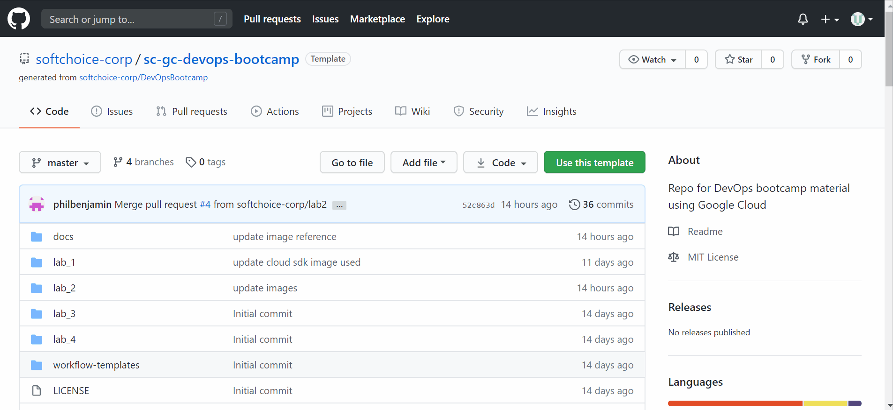
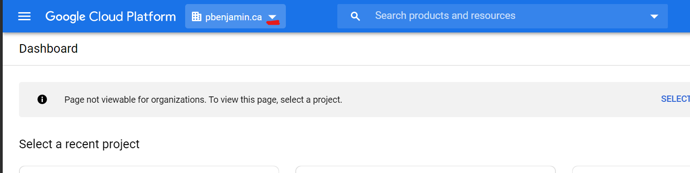
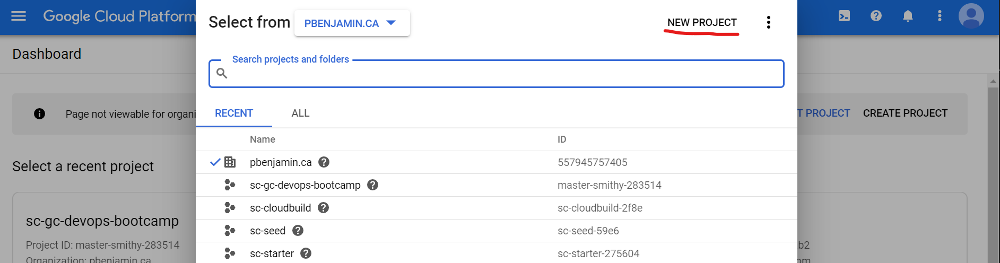
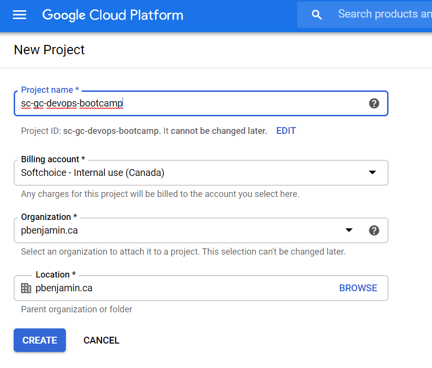
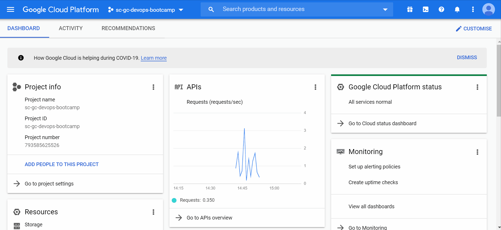
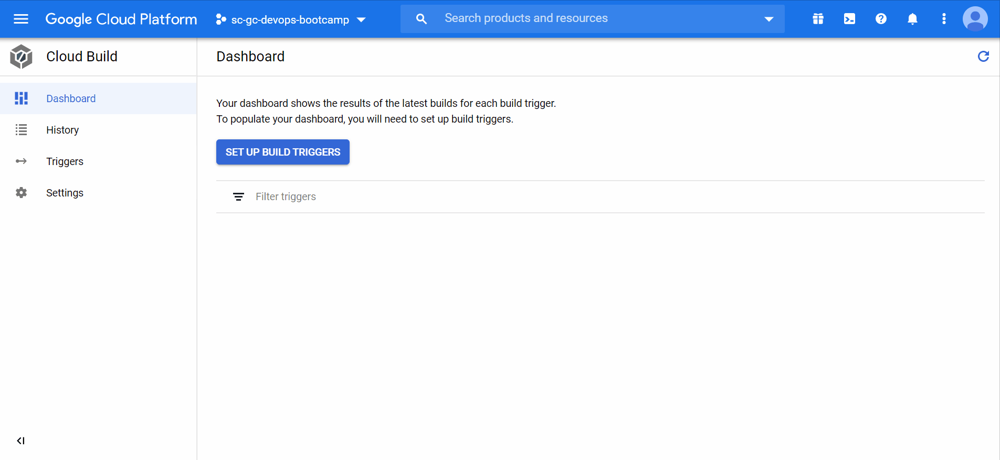
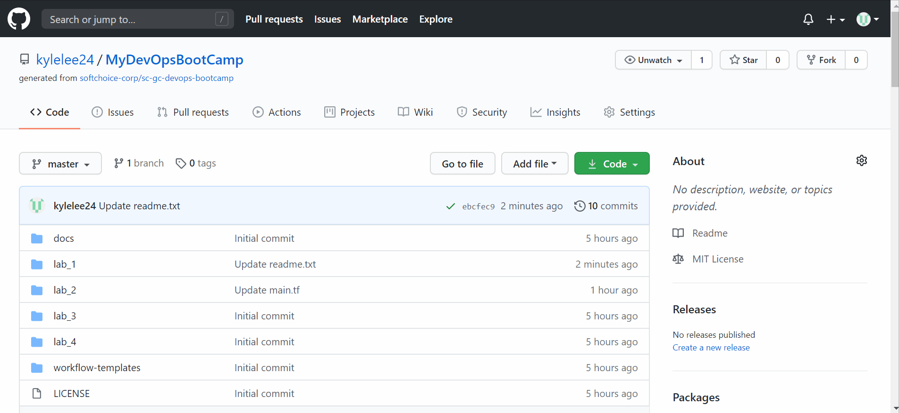
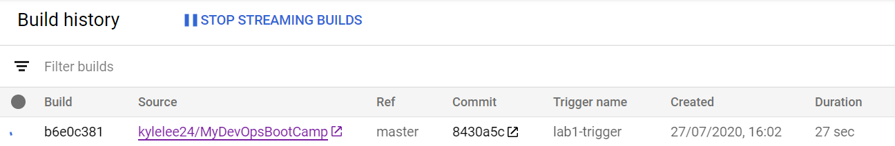
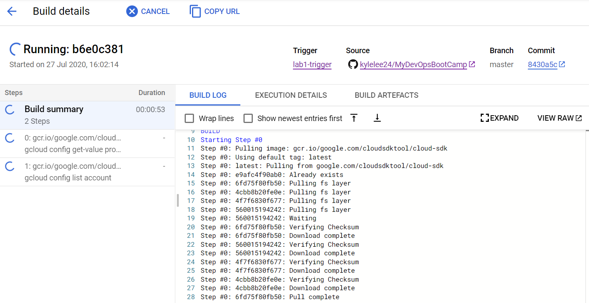

# Lab 1 - Connectivity

- [Create Repo from Template](#Create-Repo-From-Template)
- [Create Project on Google Cloud](#Create-Google-Cloud-Project)
- [Enable Cloud Build and Install GitHub App](#Enable-Cloud-Build-and-Install-GitHub-App)
- [Configure GitHub App Triggers](#Configure-GitHub-App-Triggers)
- [Run Cloud Build](#Run-Cloud-Build)

---

## Create Repo From Template

1. Access the source repo url: [https://github.com/softchoice-corp/sc-gc-devops-bootcamp](https://github.com/softchoice-corp/sc-gc-devops-bootcamp).

2. Click the green **Use this template** button. This will copy all of the content from the source repo into a new repo under your GitHub account.

3. Provide a new repository name and description. The repo can be left as `Public`, and leave the `Include all branches` option unselected. Click the green **Create repository from template** button.

4. Once the repository creation is completed you should see that your new repo is in your account, and was generated from _softchoice-corp/sc-gc-devops-bootcamp_.

> 

---

## Create Google Cloud Project

A project in Google Cloud is an isolated container for all your work and cloud resources. Create a new project for your work related to this bootcamp. Deleting a project will also delete all resources created within that project.

To create a new Project:

1. Click the Project Selector drop down at the top of your Cloud Console.

> 

2. Click New Project.

> 

3. Enter project details and click Create.

> 

4. Ensure the project you just created is selected on the Project Selector drop-down.

---

## Enable Cloud Build and Install GitHub App

1. Navigate to Cloud Build via the hamburger menu as shown below, and click 'Enable'.

> 

2. The Cloud Build GitHub App connects your GitHub repository to your Google Cloud project. Follow the directions on this [page](https://cloud.google.com/cloud-build/docs/automating-builds/create-github-app-triggers#installing_the_cloud_build_app) (under the Installing the Cloud Build app section) to install the Cloud Build GitHub App.

> 

---

## Configure GitHub App Triggers

The Cloud Build GitHub App triggers enable you to automatically invoke builds on Git pushes and pull requests, and view your build results on GitHub and [Google Cloud Console](https://console.cloud.google.com/).

1. Open the **Triggers** page in the [Google Cloud Console](https://console.cloud.google.com/) and click **Create Trigger**
2. Enter a name (E.g., `lab1-trigger`) and description (E.g., `trigger for lab 1`) for your trigger.
3. Under Event, select Push to a new branch.
4. Under Source, select the repository that was connected earlier (E.g., githubuser/MyDevOpsBootCamp (GitHub App)). Enter `.*` for branch to trigger build on all branches.
5. Expand the 'Show Included and Ignored File Filters' section and enter `lab_1/**` under 'Included files filter (glob)' to indicate that only changes under the `lab_1/` folder should trigger a build.
6. Enter `lab_1/cloudbuild-lab1.yaml` under 'Cloud Build configuration file (YAML or JSON)'. This configuration file defines the build steps that will be performed when a build is triggered.
7. Click Create to finish creating the trigger on Cloud Build.

> 

8. In GitHub, navigate to the `lab_1/cloudbuild-lab1.yaml` and we can examine what the Cloud Build config will actually do. We can see that it executes the Cloud SDK builder to run gcloud and get the current project in the first step and the second step retrieves the current account that is executing the build. As you will see (after the build has run), the current account that is executing the build is not the user that is logged in, but the default created Cloud Build service account.

```yaml
steps:
  - name: gcr.io/google.com/cloudsdktool/cloud-sdk
    args: ['gcloud', 'config', 'get-value', 'project']
  - name: gcr.io/google.com/cloudsdktool/cloud-sdk
    args: ['gcloud', 'config', 'list', 'account']
```

---

## Run Cloud Build

The workflow we just created is triggered by changes made to the files in the `lab_1/` directory. Let's make a change here to kick off the workflow. The `readme.txt` can be modified by simply adding a new line or some text. The act of committing this change to any branch will instruct Cloud Build to trigger a build.

1. Navigate to **Code** in GitHub, and browse to the `lab_1/readme.txt` file. Click the pencil icon to edit the file, and add a new line. Provide a commit message and commit your change.

> 

2. Navigate to **Cloud Build -> History** and you should see the build executing with the lab1-trigger name.

> 

3. Click the build id and you can explore the results of this execution. You will see the results of executing the build steps within the window.

> 

4. Ensure that the build is successful in the execution results.

> 

---

## End of Lab 1

Links to more learning:

- **Cloud Builders**: [https://cloud.google.com/cloud-build/docs/cloud-builders](https://cloud.google.com/cloud-build/docs/cloud-builders)
- **Build Config Files**: [https://cloud.google.com/cloud-build/docs/build-config](https://cloud.google.com/cloud-build/docs/build-config)
- **Create GitHub App Triggers**: [https://cloud.google.com/cloud-build/docs/automating-builds/create-github-app-triggers](https://cloud.google.com/cloud-build/docs/automating-builds/create-github-app-triggers)
- **Create a basic Build Config file**: [https://cloud.google.com/cloud-build/docs/configuring-builds/create-basic-configuration](https://cloud.google.com/cloud-build/docs/configuring-builds/create-basic-configuration)
- **Best practicies for speeding up builds**: [https://cloud.google.com/cloud-build/docs/speeding-up-builds]


