# Lab 3 - GitHub Actions

- [Create Google App Engine Instance](#Create-Google-App-Engine-Instance)
- [Enable App Engine Admin API](#Enable-App-Admin-API)
- [Configure GitHub App Trigger](#Configure-GitHub-App-Trigger)
- [Run Cloud Build](#Run-Cloud-Build)
- [Continuous Deployment of Changes](#Continuous-Deployment-of-Changes)
- [Unit Testing](#Unit-Testing)

---

## Overview

The third lab will deploy a NodeJS Web Application to App Engine using Cloud Build.

> At this time, there is a 1:1 mapping between an application on App Engine and the project it is deployed to and deleting an application is not supported. To stop traffic and stop costs incurred by App Engine, the application can be disabled instead. However, you can delete a service in App Engine, except for the `default` service. See [here](https://cloud.google.com/appengine/docs/standard/nodejs/an-overview-of-app-engine) for more information on App Engine.

## Create Google App Engine Application

Create the Google App Engine Application that the pipeline will deploy to.

1. Navigate to `App Engine` from the top left menu, it will be under the `Compute` sub-heading.

You will notice that there is currently no application and the option to create one is available.

> Note that you can use the UI to create the application. However, we will use the `gcloud` command to show an alternative for automation use.

2. Open Cloud Shell

3. Create the Google App Engine Application

```bash
gcloud app create --region=us-central
```

4. Refresh the page. You will see that your App Engine application has been created.

> 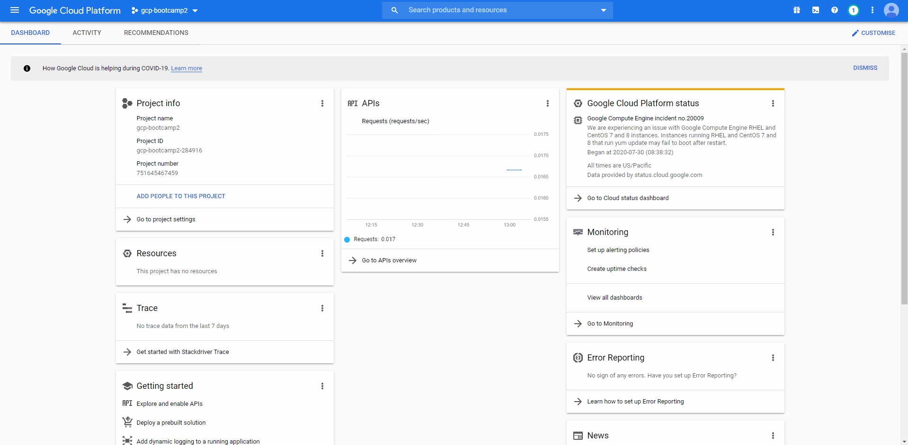

That's it for the application creation! Now you can deploy your web service to App Engine. This action (creating an `application` on App Engine) creates an isolated environment to deploy and run your web service over multiple servers but does not actually deploy it yet. In an App Engine project, you can deploy multiple microservices as separate services, previously known as modules in App Engine. The application we created has a default service that we will deploy to and host our site.

---

## Enable App Engine Admin API

Since we will be using Cloud Build to deploy our application, we need to enable the `App Engine Admin API`. This will allow other services, such as Cloud Build, to administer on App Engine.

> Note that you can use the UI to enable the API. However, we will use the `gcloud` command to show an alternative for automation use.

1. Navigate to `APIs & Services` from the top left menu.

2. Click the **+ Enable APIs and Services** on the top heading.

3. In the search field, enter `App Engine Admin API`. Select it from the populated results.

4. Notice that there is an **Enable** button. If you choose to enable the API through the UI you can skip steps 5 - 8.

5. Open Cloud Shell

6. Enable the `App Engine Admin API`

```bash
gcloud services enable appengine.googleapis.com
```

7. Go back to the API library by clicking the back arrow at the top left.

8. Select the `App Engine Admin API` again from the result list. Notice that the API is now enabled and can be used by Cloud Build.

> 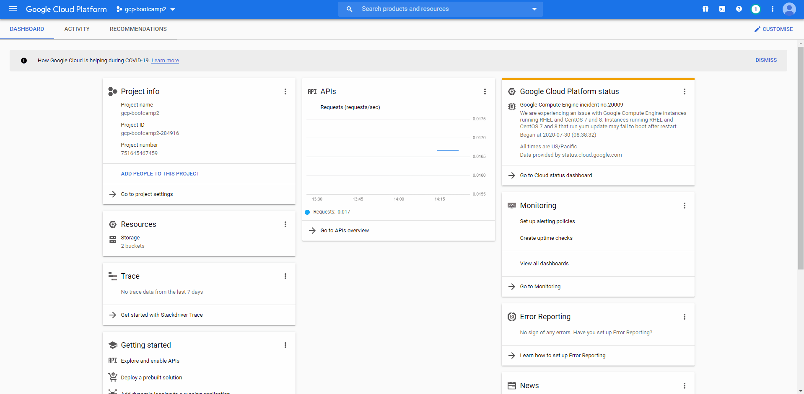

> It is important to note that any account which has the `Editor` role, such as the Cloud Build service account for the labs, will automatically have permissions to administer App Engine. To follow the standard rule of least privilege, a more appropriate role would be the `App Engine Admin` role, which provides permission to App Engine.

---

## Configure GitHub App Trigger

We will now configure a Cloud Build trigger that will run the terraform commands to deploy the networking and compute resources in this project. This is following a similar process as Lab 2, with the exception of the terraform `destroy.txt` file being ignored.

1. Open the **Triggers** page in the [Google Cloud Console](https://console.cloud.google.com/) and click **Create Trigger**

2. Similar to Lab 1 and Lab 2, enter a name (E.g., `lab3-trigger`) and description (E.g., `trigger for lab 3`) for your trigger.

3. Under Event, select `Push to a new branch`.

4. Under Source, select the repository that was connected earlier (E.g., githubuser/MyDevOpsBootCamp (GitHub App)). Enter `.*` for branch to trigger build on all branches.

5. Expand the 'Show Included and Ignored File Filters' section and enter `lab_3/**` under 'Included files filter (glob)' to indicate that only changes under the `lab_3/` folder should trigger a build.

6. Enter `lab_3/cloudbuild-lab3.yaml` under 'Cloud Build configuration file (YAML or JSON)'. This configuration file defines the build steps that will be performed when a build is triggered.

7. Click Create to finish creating the trigger on Cloud Build.

> 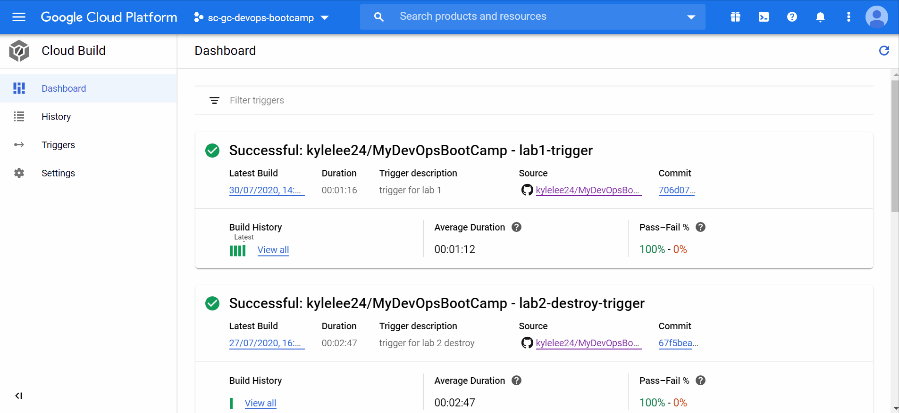

---

## Run Cloud Build

The workflow we just created is triggered by changes made to the files in the `lab_3/` directory. Let's make a change here to kick off the workflow. The `readme.txt` can be modified by simply adding a new line or some text. The act of committing this change to the `master` branch will instruct GitHub Actions to kick off our workflow.

1. Navigate to **Code**, and browse to the `lab_3/readme.txt` file. Click the pencil icon to edit the file, and add a new line. Provide a commit message and commit your change.

2. Navigate to **Cloud Build -> History** and you should see the build executing with the lab3-trigger name.

3. The workflow for Lab 3 is going to take a few minutes to execute. While it is running take a look at the application configuration file (E.g., `app/app.yaml`) to see how App Engine will configure environment.

> Although the mapping is 1-to-1 between project and App Engine application, you can create more than one service in the application. The application includes a default service, appropriately named `default`, which cannot be deleted. For more information see the Google documentation [here](https://cloud.google.com/appengine/docs/standard/nodejs/an-overview-of-app-engine#services).

4. Once the build finishes, open a browser window and navigate to to `https://<Project ID>.<Region code>.r.appspot.com`. Replace `<Project ID>` with your Project ID and `<Region code>` in this example, the region code `uc` is for `us-central`. The URL can also be found on the `gcloud app deploy` step of the Cloud Build pipeline.

> 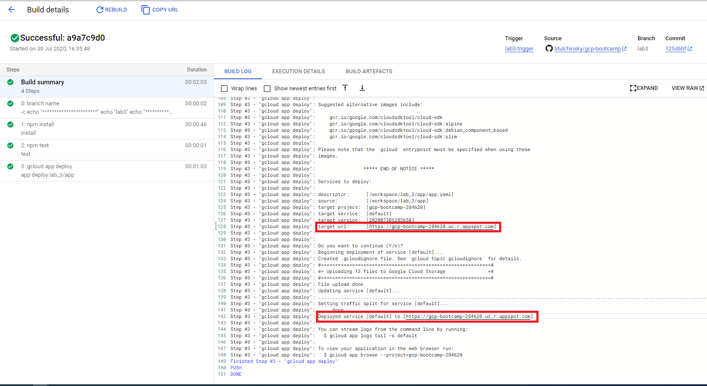

> Note that `https://<Project ID>.appspot.com` will also display the website. However, App Engine is moving away from this URL designation and will make the region required for all new application. See [here](https://cloud.google.com/appengine/docs/standard/nodejs/how-requests-are-routed#region-id) for more information.

Here is how the website you just deployed will look like

> 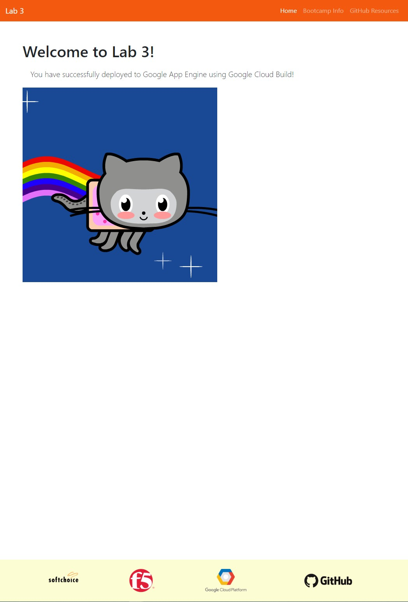

---

## Continuous Deployment of Changes

We will make some changes to the code and watch the pipeline automatically deploy those changes to the application.

1. Navigate to **Code**, open the `lab_3/app/public` directory and open the `index.html` file.

2. Find the Octodex image element (`img` tag) identified with the `id` attribute `octodex`.

> 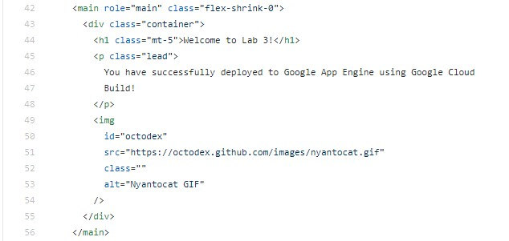

3. Go to [https://octodex.github.com/](https://octodex.github.com/) and copy the image address of an Octodex that you like.

> 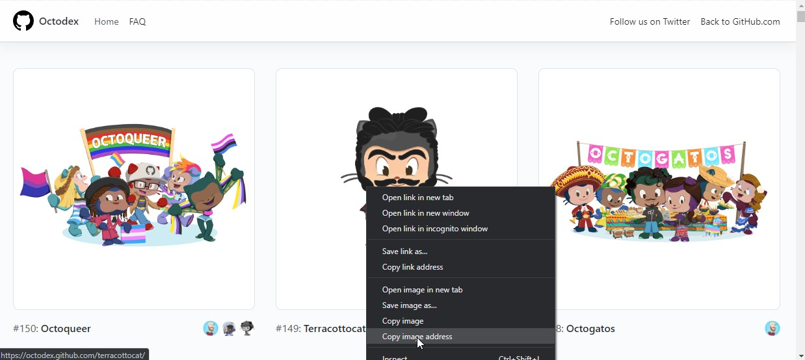

4. Update the `alt` and `src` attribute of the octodex `img` tag with description and copied address, respectively.

> 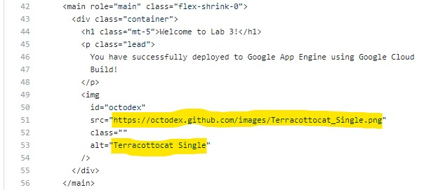

5. Enter a commit message and click `Commit changes`.

> 

6. Navigate to **Cloud Build -> History** and you should see the build executing with the lab3-trigger name.

> 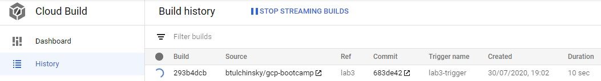

7. When the build finishes executing, open your browser and refresh or go to the `<Project name>.<Region code>.r.appspot.com` website to observe the change in the application.

> 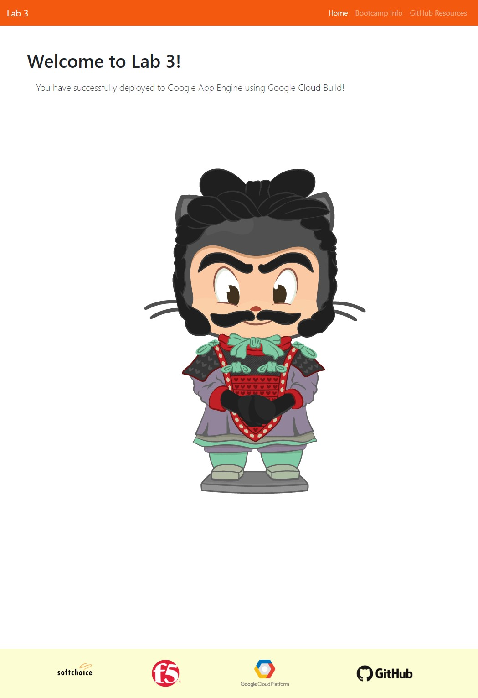

---

## Unit Testing

We have deployed our application successfully due to the defined unit tests passing successfully. We will now intentionally introduce an error into the application.

1. Navigate to **Code**, open the `lab_3/app/` directory and open the `index.js` file.

> 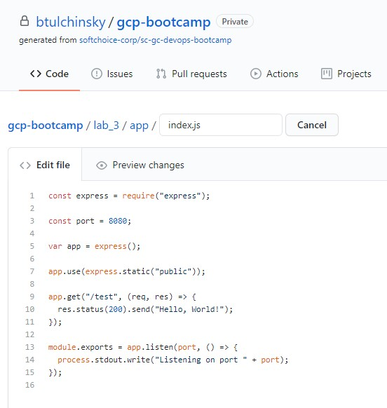

2. Change the `Hello, World!` text in the service `/path` response. It can be any misspelling or a completely different text, as long as it is different.

> 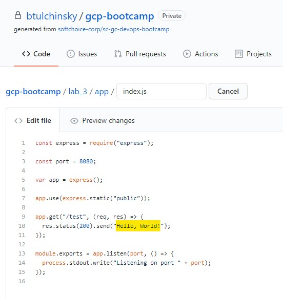

> 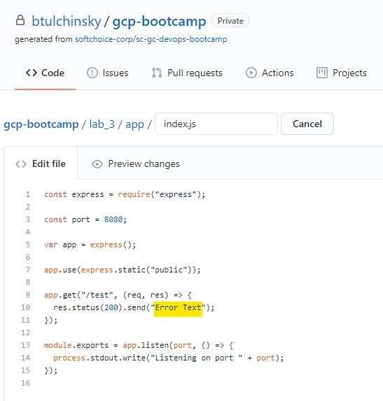

3. Enter a commit message and click `Commit changes`.

> 

4. Navigate to **Cloud Build -> History** to observe the build, which will fail.

> 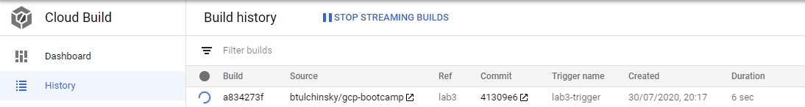

> 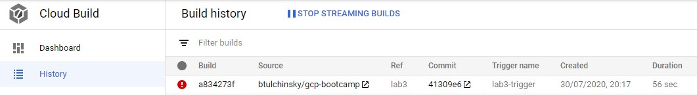

5. Click on the build to take a look at the more granular steps the build is running and expand the `npm test` step.

> 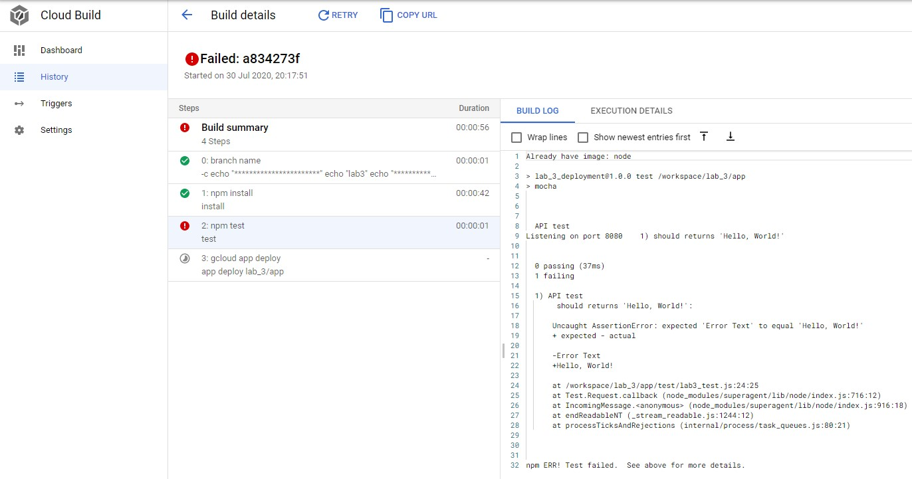

6. Notice that the `API test` unit test failed and the `gcloud app deploy` step was skipped. This is the default behaviour when an error occurs and the build is in a failed state.

> 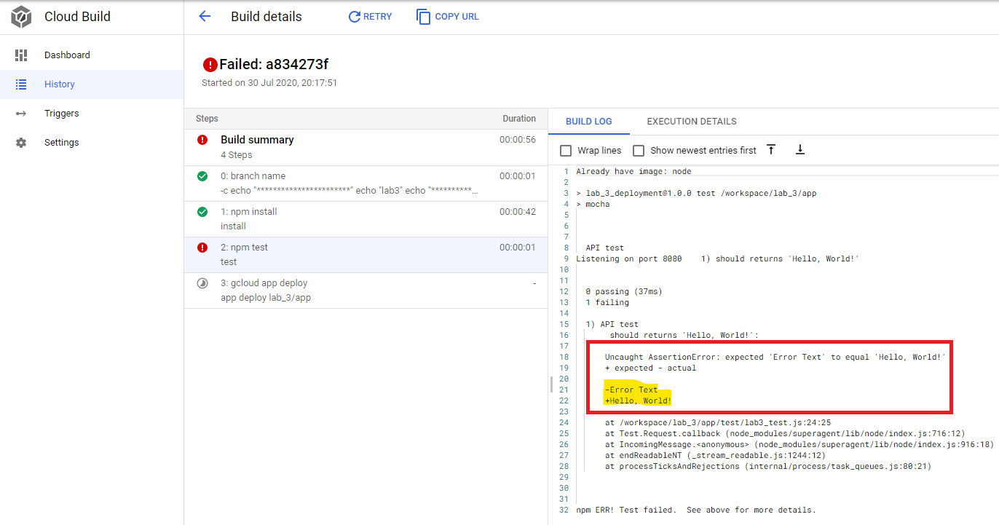

7. Fix the build by correcting the `lab_3/app/index.js` file with the proper text and commit the change.

---

## Disable the Application

To mimimize billing usage in your project, we can disable the application to reduce costs incurred by the application. Since the application can only be deleted along with the project, disabling it is the best way, unless of course, you would like to delete the project.

1. From the Google Cloud Console menu, select `App Engine` under `Compute`.

2. Select **Settings** at the bottom at the bottom of the left menu.

3. Click on the **Disable application** button. Enter the `Project ID` when prompted.

4. Click **Disable**.

> 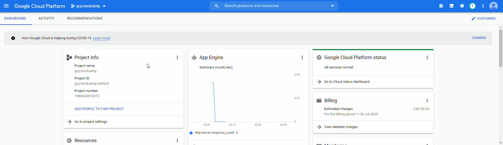

## End of Lab 3

Links to more learning:

- **App Engine Overview**: [https://cloud.google.com/appengine/docs/standard/nodejs/an-overview-of-app-engine](https://cloud.google.com/appengine/docs/standard/nodejs/an-overview-of-app-engine)
- **App Engine Routing**: [https://cloud.google.com/appengine/docs/standard/nodejs/how-requests-are-routed](https://cloud.google.com/appengine/docs/standard/nodejs/how-requests-are-routed)
- **App Engine Configuration (NodeJS)**: [https://cloud.google.com/appengine/docs/standard/nodejs/config/appref](https://cloud.google.com/appengine/docs/standard/nodejs/config/appref)
- **Cloud Build Configuration**: [https://cloud.google.com/cloud-build/docs/build-config](https://cloud.google.com/cloud-build/docs/build-config)
- **Unit Testing**: [https://en.wikipedia.org/wiki/Unit_testing](https://en.wikipedia.org/wiki/Unit_testing)


