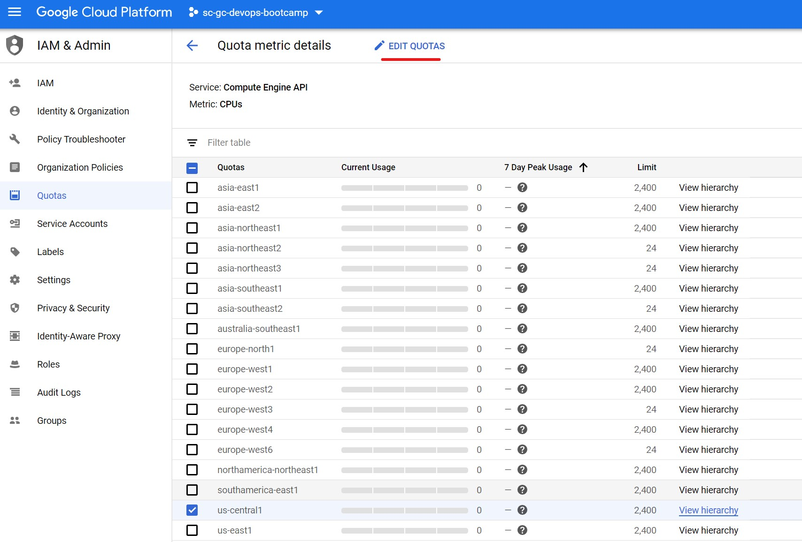
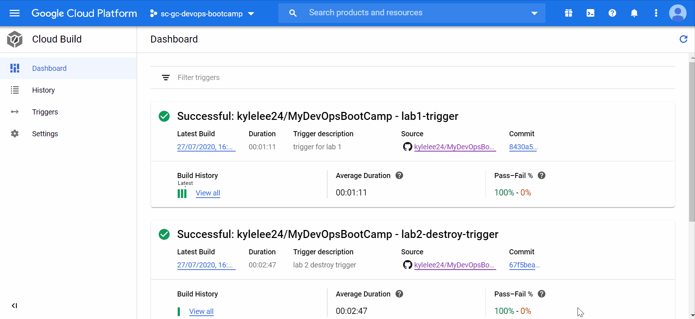
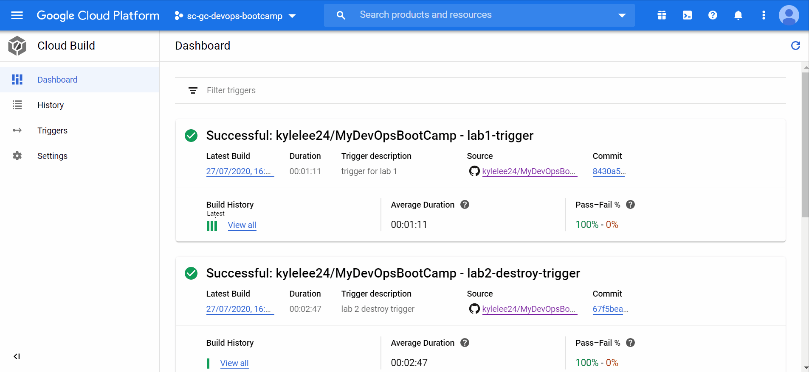
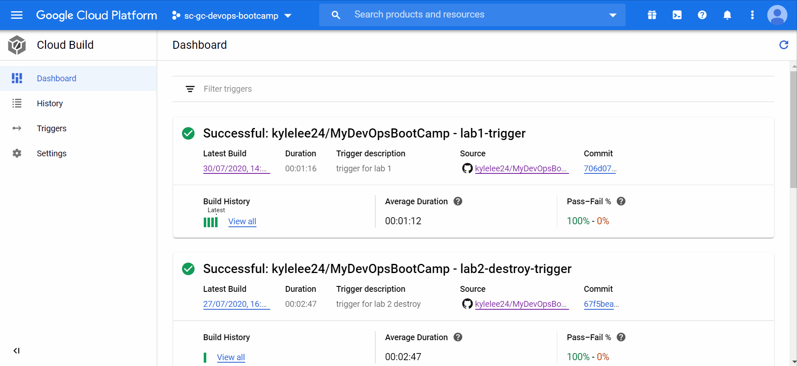

# Lab 4 - Deploy 75 Servers

- [Overview](#Overview)
- [Configure GitHub App Triggers](#Configure-GitHub-App-Triggers)
- [Create Terraform Deployment](#Create-Terraform-Deployment)
- [Clean Up Resources](#Clean-Up-Resources)

---

## Overview

The fourth lab is a demo of how we can quickly deploy 75 servers to Google Cloud.

> Note: Executing this lab will result in **75** `n1-standard-1` vm's being deployed in your environment. If you have not made the appropriate quota increase requests, this may not complete successfully. A workaround to deploy a smaller number of VMs will be provided in the section below.

> 

---

## Configure GitHub App Triggers

We will now configure a Cloud Build trigger that will run the terraform commands to deploy the networking and compute resources in this project.

1. Open the **Triggers** page in the [Google Cloud Console](https://console.cloud.google.com/) and click **Create Trigger**

2. Similar to Lab 1, enter a name (E.g., `lab4-trigger`) and description (E.g., `trigger for lab 4`) for your trigger.

3. Under Event, select Push to a new branch.

4. Under Source, select the repository that was connected earlier (E.g., githubuser/MyDevOpsBootCamp (GitHub App)). Enter `.*` for branch to trigger build on all branches.

5. Expand the 'Show Included and Ignored File Filters' section and enter `lab_4/**` under 'Included files filter (glob)' to indicate that only changes under the `lab_4/` folder should trigger a build. Enter `lab_4/destroy.txt` under 'Ignored files filter (glob)' to indicate that the file should not trigger a build.

6. Enter `lab_4/cloudbuild-lab4.yaml` under 'Cloud Build configuration file (YAML or JSON)'. This configuration file defines the build steps that will be performed when a build is triggered.

7. Under 'Substitution variables', Enter `_NODE_COUNT` as the variable with the value `75`. The value will be the number of virtual machines that gets deployed. If no quota increases were requested, set the value as `4` to avoid quota errors.

8. Click Create to finish creating the trigger on Cloud Build.

> 

---

## Create Terraform Deployment

Trigger a terraform deployment to create 75 vm's via GitHub and Cloud Build

1. In GitHub, edit the `lab_4/backend.tf` file and update the `bucket` value with the Google Storage bucket name (E.g., `sc-gc-devops-bootcamp-284719-tfstate`) created in lab 2. You can copy the modified backend file from `lab_2/backend.tf`. Commit the changes.

Example:

```json
terraform {
  backend "gcs" {
    bucket = "sc-gc-devops-bootcamp-284719-tfstate"
    prefix = "terraform/bootstrap/state"
  }
}
```

2. Navigate to **Code**, and browse to the `lab_4/readme.txt` file. Click the pencil icon to edit the file, and add a new line. Provide a commit message and commit your change.

---

## Clean Up Resources

To mimimize billing usage in your subscription we can remove all of the resources we deployed with Cloud Build by executing a Terraform destroy.

1. Create a new trigger on Cloud Build called `lab4-destroy-trigger`.

2. Use similar settings to the trigger created previously, except set the Included files filter to `lab_4/destroy.txt`, leave the Ignored files filter blank. For the Build Configuration, set the Cloud Build configuration file to `lab_4/cloudbuild-destroy-lab4.yaml`. Under 'Substitution variables', Enter `_NODE_COUNT` as the variable with the value `75`. Click create to finish creating the trigger.

> 

3. Go to the triggers page and select Run trigger to manually execute the build, which will destroy all the resources created.

> 

4. Once the build is completed we can open the [Google Cloud Console](https://console.cloud.google.com/) and confirm the resources we created earlier are now deleted.

---

## End of Lab 4

